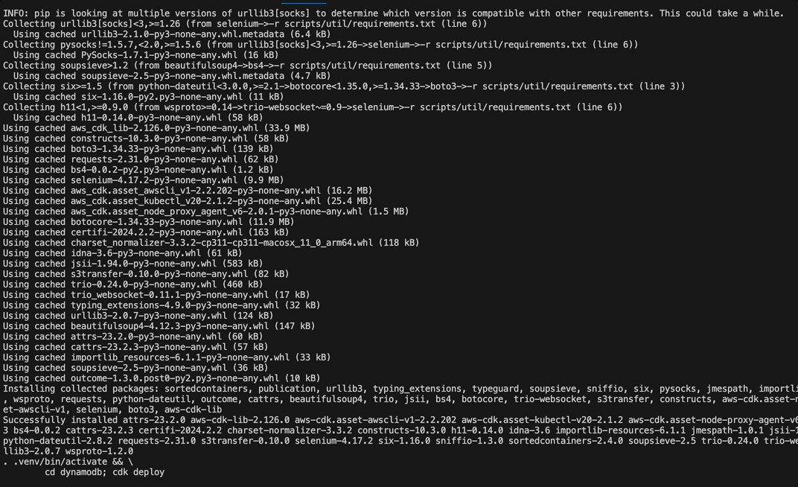

# NRL Stat Tracker

## Introduction

NRL Stat Tracker is a dynamic tool designed for tracking and analyzing statistics from the National Rugby League (NRL). It automates the process of updating team statistics, ladder standings, and other relevant data using a series of Python scripts.

## Installation

### Prerequisites

- Python 3.x
- Required Python libraries (listed in `requirements.txt`)

### Setup

1. Clone the repository:
   ```bash
   git clone [repository URL]
   ```
2. Navigate to the project directory:
   ```bash
   cd nrl-stat-tracker
   ```
3. Build the project (which includes installing dependencies):
   ```bash
   make build
   ```

## Usage

Use the `make` command to execute various tasks:

- **Build the Project**:
  ```bash
  make build
  ```

  

- **Update Team Statistics**:
  ```bash
  make update-teams
  ```
- **Update Ladder Information**:
  ```bash
  make update-ladder
  ```

  


## Contributing

Contributions to NRL Stat Tracker are welcome! To contribute:

1. Fork the repository.
2. Create a new branch (`git checkout -b feature-branch`).
3. Make your changes.
4. Commit your changes (`git commit -am 'Add some feature'`).
5. Push to the branch (`git push origin feature-branch`).
6. Create a new Pull Request.

## License

This project is licensed under the [MIT License](LICENSE) - see the LICENSE file for details.

